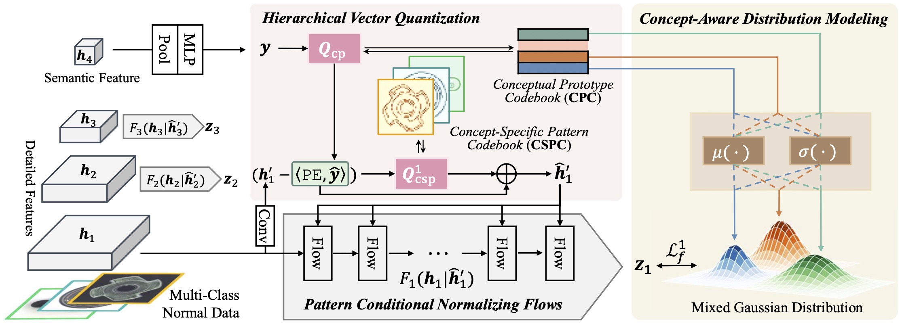

# VQ-Flow: Taming Normalizing Flows for Multi-Class Anomaly Detection via Hierarchical Vector Quantization

This is an official implementation of "VQ-Flow: Taming Normalizing Flows for Multi-Class Anomaly Detection via Hierarchical Vector Quantization".

## Abstract

Normalizing flows, a category of probabilistic models famed for their capabilities in modeling complex data distributions, have exhibited remarkable efficacy in unsupervised anomaly detection. This paper explores the potential of normalizing flows in multi-class anomaly detection, wherein the normal data is compounded with multiple classes without providing class labels. Through the integration of vector quantization (VQ), we empower the flow models to distinguish different concepts of multi-class normal data in an unsupervised manner, resulting in a novel flow-based unified method, named VQ-Flow. Specifically, our VQ-Flow leverages hierarchical vector quantization to estimate two relative codebooks: a Conceptual Prototype Codebook (CPC) for concept distinction and its concomitant Concept-Specific Pattern Codebook (CSPC) to capture concept-specific normal patterns. The flow models in VQ-Flow are conditioned on the concept-specific patterns captured in CSPC, capable of modeling specific normal patterns associated with different concepts. Moreover, CPC further enables our VQ-Flow for concept-aware distribution modeling, faithfully mimicking the intricate multi-class normal distribution through a mixed Gaussian distribution reparametrized on the conceptual prototypes. Through the introduction of vector quantization, the proposed VQ-Flow advances the state-of-the-art in multi-class anomaly detection within a unified training scheme, yielding the Det./Loc. AUROC of 99.5%/98.3% on MVTec AD.



## Enviroment

- Python 3.9
- PyTorch = 2.1.1
- CUDA 11.8
- [FrEIA](https://github.com/VLL-HD/FrEIA) (Please install FrEIA following the [official installation](https://github.com/VLL-HD/FrEIA#table-of-contents))

We provide our environment in `environment.yaml`

## Prepare datasets

It is recommended to symlink the dataset root to `$vqflow/data`.
If your folder structure is different, you may need to change the corresponding paths in `default.py`.

**For MVTec AD data**, please download from [MVTec AD download](https://www.mvtec.com/company/research/datasets/mvtec-ad). Download and extract them to `$vqflow/data`, and make them look like the following data tree:

```shell
MVTec
├── bottle
│   ├── ground_truth
│   │   ├── broken_large
│   │   └── ...
│   ├── test
│   │   ├── good
│   │   ├── broken_large
│   │   └── ...
│   └── train
│       └── good
├── cable
└── ...
```

**For VisA data**, please download from [VisA download](https://amazon-visual-anomaly.s3.us-west-2.amazonaws.com/VisA_20220922.tar). Download and extract them to `$vqflow/data`, and make them look like the following data tree:

```shell
VisA
├── candle
│   ├── ground_truth
│   │   └── bad
│   ├── test
│   │   ├── bad
│   │   └── good
│   └── train
│       └── good
├── capsules
└── ...
```

Thanks [spot-diff](https://github.com/amazon-science/spot-diff/tree/main) for providing the code to reorganize the VisA dataset in MVTec AD format. For more details, please refer to this [data preparation guide](https://github.com/amazon-science/spot-diff/tree/main#data-preparation).

## Training and Testing

All checkpoints will be saved to the working directory, which is specified by `work_dir` in the `default` file.

By default, we evaluate the model on the test set after each meta epoch, you can change the pro evaluation interval by modifying the interval argument in the shell or `default` file.

### Training

For MVTec AD dataset:
```shell
CUDA_VISIBLE_DEVICES=0 python main.py --mode train --dataset mvtec --class-names all --multi-class \
            --quantize-enable --quantize-type residual --concat-pos \
            --mixed-gaussian \
            --extractor convnextv2_base 
```

For VisA dataset:
```shell
CUDA_VISIBLE_DEVICES=0 python main.py --mode train --dataset visa --class-names all --multi-class \
            --quantize-enable --quantize-type residual --concat-pos \
            --mixed-gaussian \
            --extractor convnextv2_base 
```

### Testing

```shell
CUDA_VISIBLE_DEVICES=0 python main.py --mode test --dataset mvtec --class-names all --multi-class \
            --quantize-enable --quantize-type residual --concat-pos \
            --mixed-gaussian \
            --extractor convnextv2_base \
            --eval_ckpt $CKPT_PATH
```

## Results on the MVTec AD benchmark

| Classes             | Det. AUROC | Loc. AUROC |
| ------------------- | :--------: | :--------: |
| Carpet              |    99.9    |    98.6    |
| Grid                |    99.9    |    99.1    |
| Leather             |   100.0    |    99.0    |
| Tile                |    99.9    |    97.2    |
| Wood                |   100.0    |    95.5    |
| Bottle              |   100.0    |    98.4    |
| Cable               |    99.1    |    97.9    |
| Capsule             |    99.0    |    99.3    |
| Hazelnut            |   100.0    |    99.2    |
| Metal Nut           |   100.0    |    98.8    |
| Pill                |    98.2    |    98.8    |
| Screw               |    98.4    |    99.0    |
| Toothbrush          |    98.2    |    98.8    |
| Transistor          |   100.0    |    96.3    |
| Zipper              |   100.0    |    98.9    |
| **Overall Average** |  **99.5**  |  **98.3**  |

## Results on the VisA benchmark

| Classes             | Det. AUROC | Loc. AUROC |
| ------------------- | :--------: | :--------: |
| candle              |    98.3    |    99.2    |
| capsules            |    96.6    |    99.5    |
| cashew              |    96.8    |    99.4    |
| chewinggum          |    99.7    |    99.1    |
| fryum               |    98.8    |    96.1    |
| macaroni1           |    94.4    |    99.2    |
| macaroni2           |    84.4    |    98.8    |
| pcb1                |    95.3    |    99.6    |
| pcb2                |    96.2    |    98.6    |
| pcb3                |    94.9    |    98.9    |
| pcb4                |    99.3    |    98.9    |
| pipe_fryum          |    99.2    |    99.1    |
| **Overall Average** |  **95.9**  |  **98.9**  |


## Thanks to

- [FrEIA](https://github.com/VLL-HD/FrEIA)
- [vqflow](https://github.com/cool-xuan/vqflow)
- [spot-diff](https://github.com/amazon-science/spot-diff/tree/main)
